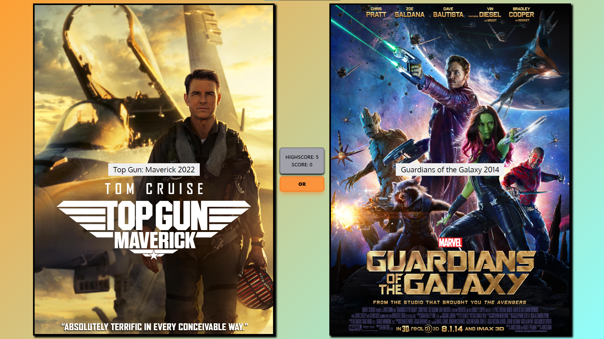
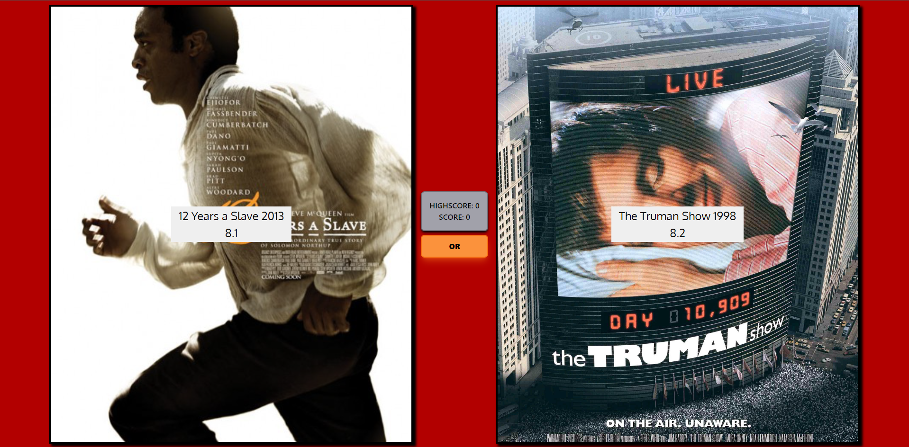

# Higher/Lower Movie Rating Game

A browser‑based game where players guess which movie has the higher IMDb rating. Built as a **personal learning project to get started with React**, it goes beyond a simple tutorial by adding **local score persistence** and **performance optimisations** to reduce unnecessary API calls and improve responsiveness.  

Originally hosted at **higherlowermovies.com**, the domain was discontinued due to high renewal costs. The project remains live via its **Vercel deployment** and is fully open‑source on GitHub.  

---
## ✨ Features
- Guess which of two movies has the higher IMDb rating  
- Local score persistence to track best runs across sessions  
- Responsive design for desktop and mobile  
---

## 🚀 Tech Stack
- **Frontend:** React, TailwindCSS, JavaScript  
- **API:** RapidAPI (Movies Database API)  
- **Hosting:** Vercel  

---
## 📸 Screenshots
- **Game Screen**  
  

- **Loss Screen**  
  

## 🔗 Links
- **Live Demo:** [Vercel Deployment](https://higherlowermovies.netlify.app/)  
